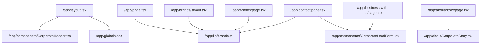
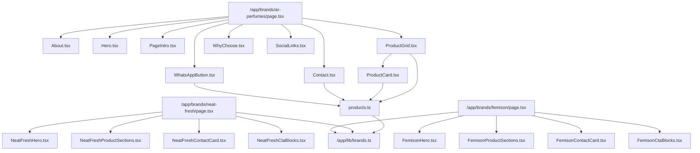

# Maintainability Audit

Last updated: 2026-02-10

## 1) Safe Cleanup Plan

### Objective
Remove dead and duplicate code paths while preserving runtime behavior and legacy link compatibility.

### Executed Safety Controls
1. Rewired the only active dependency on root-level legacy React components.
2. Added permanent redirects for legacy HTML entry points.
3. Removed dead folders and files only after dependency checks.
4. Rebuilt the app to validate route generation and compilation.

### Removed Surface Area
- `/components` (legacy duplicate React AR components)
- `/data` (legacy duplicate AR product dataset)
- `/styles` (legacy duplicate AR CSS module)
- `/index.html`
- `/collection.html`
- `/about.html`
- `/contact.html`
- `/product.html`
- `/css`
- `/js`
- `/images`

### Active Replacement Paths
- AR components/data now live only under:
  - `/app/brands/ar-perfumes/components`
- Shared corporate components/data:
  - `/app/components`
  - `/app/lib`

## 2) Legacy -> Next.js Migration Map

| Legacy File / URL | Active Next Route | Notes |
| --- | --- | --- |
| `/index.html` | `/` and `/brands/ar-perfumes` | Legacy AR home content is represented in AR brand route; corporate home remains `/`. |
| `/collection.html` | `/brands/ar-perfumes` | Product collection now lives in AR brand page sections. |
| `/about.html` | `/about` | Corporate about moved to App Router about route. |
| `/contact.html` | `/contact` | Corporate contact and lead flow moved to App Router contact route. |
| `/product.html?name=*` | `/brands/ar-perfumes` | No standalone product detail route in current app; product intent handled in AR section/WhatsApp flow. |

### Redirects Implemented
Configured in `/next.config.js`:
- `/index.html` -> `/`
- `/collection.html` -> `/brands/ar-perfumes`
- `/about.html` -> `/about`
- `/contact.html` -> `/contact`
- `/product.html` -> `/brands/ar-perfumes`

## 3) Module Dependency Graph (Internal Imports)

### Graph A: App-Level Composition

### Graph B: Brand Modules

### High-Value Maintainability Notes
1. Brand contact/source-of-truth is centralized in `/app/lib/brands.ts`.
2. AR brand keeps a self-contained component module under `/app/brands/ar-perfumes/components`.
3. Corporate lead flow is centralized in `/app/components/CorporateLeadForm.tsx`.
